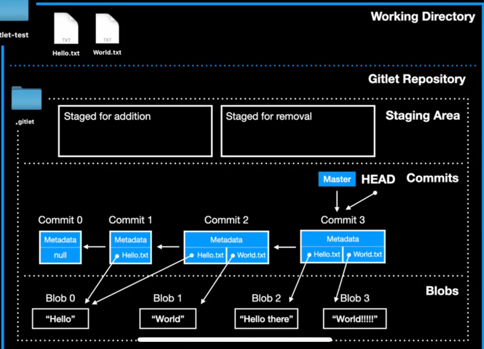

# gitlet项目说明
基本逻辑

* commit命令执行过程：
  * 克隆当前HEAD指向的Commit节点
  * 根据用户输入修改当前Commit的message和timeStamp
  * 根据Staging Area（暂存区 通过add将文件添加到其中）中的文件修改当前Commit的files
  * 

### Commit类
- 属性和方法
  - message - commit的信息
  - timeStamp - 时间戳
  - parent - Commit : 指向上一个commit

### Main 主类
- 判断用户输入的操作信息
- 根据不同的参数，调用对应的方法

### 算法
- SHA-1加密
- BFS---用于寻找当前分支和给定分支的拆分点

### 持久化

### merge

