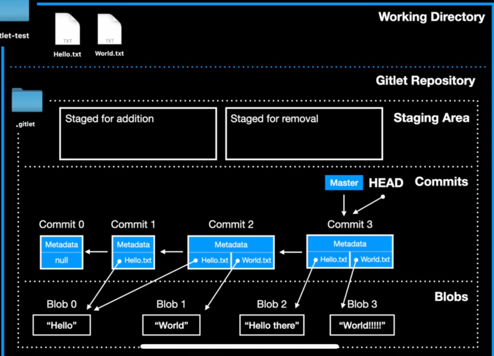

# gitlet基本逻辑

### Commit类
- 属性和方法
  - message - commit的信息
  - timeStamp - 时间戳
  - parent - string[] : 指向上一个commit
  - blobs  - HashMap<> : 存储文件名和SHA-1哈希值

### Main 主类
- 判断用户输入的操作信息
- 根据不同的参数，调用对应的方法

### 算法
- SHA-1加密
- BFS---寻找拆分点

### 持久化

### merge

